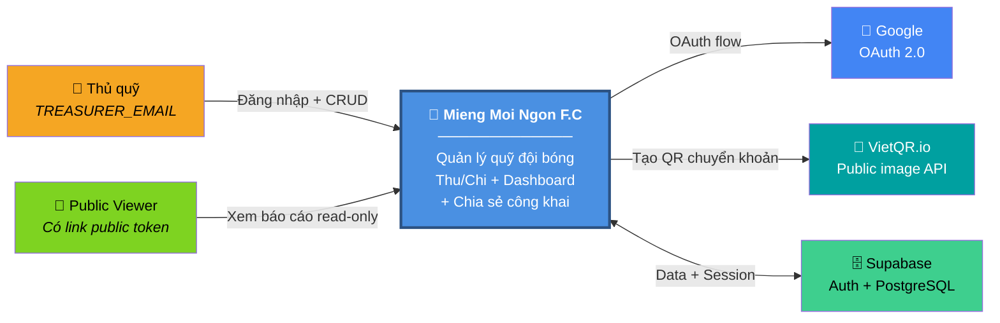
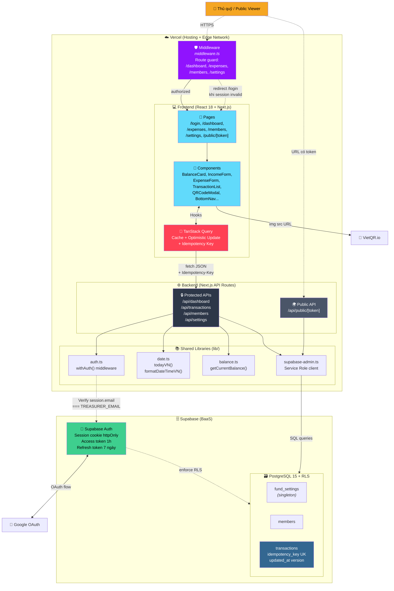
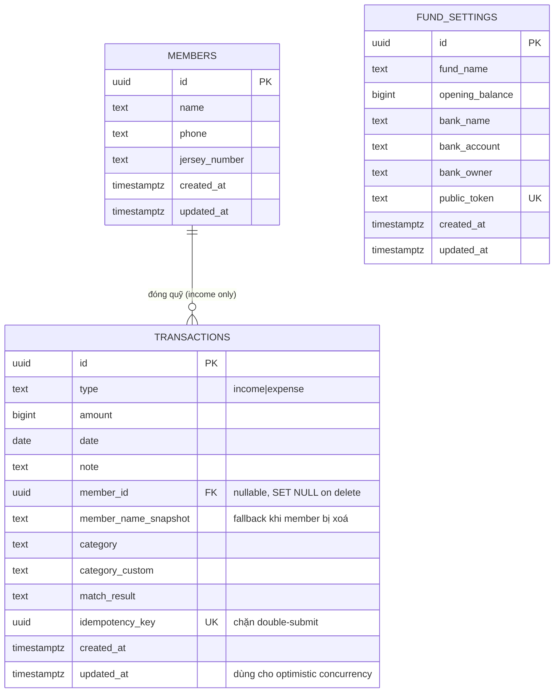
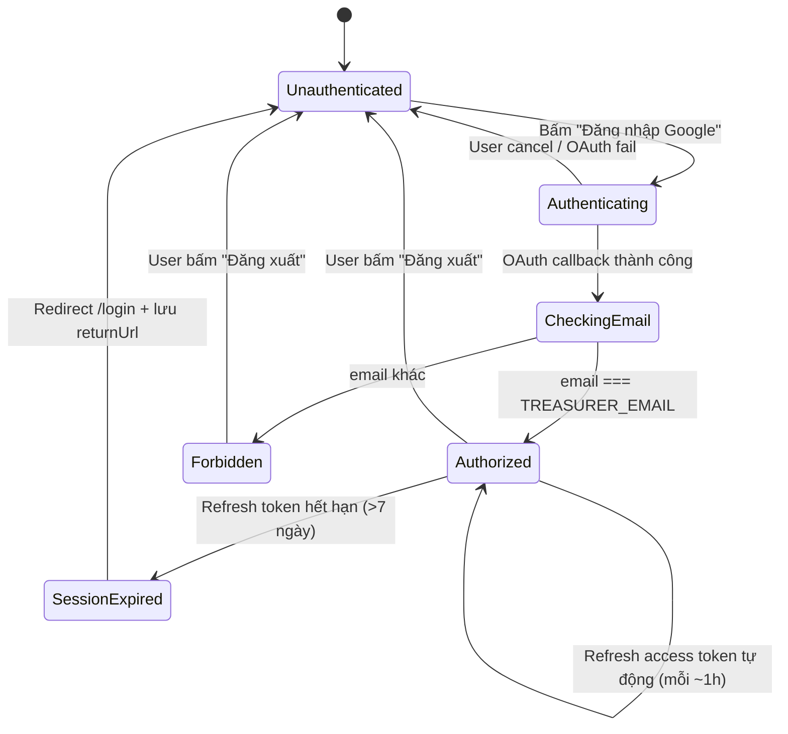
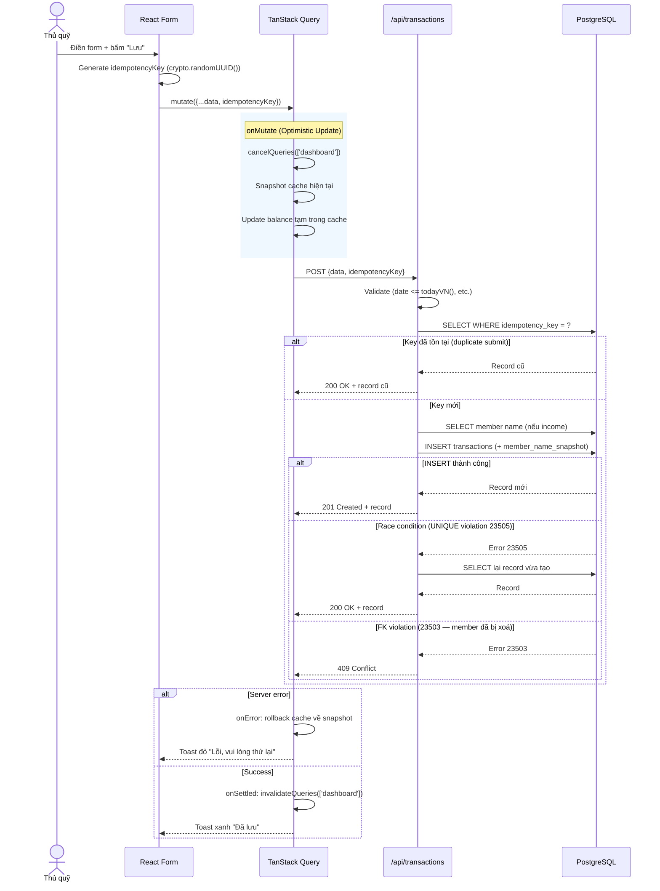

# TDD — Mieng Moi Ngon F.C
> Technical Design Document — v1.2
> Dựa trên PRD v1.1 (16/04/2026)
> Cập nhật sau vòng review senior dev + Architecture diagrams (19/04/2026)

---

## 0. Tóm tắt các Quyết định Kỹ thuật

| # | Quyết định | Lựa chọn | Lý do |
|---|---|---|---|
| 1 | Balance Calculation | Tính động bằng SUM query | Luôn chính xác, đủ nhanh cho quy mô nhỏ |
| 2 | Transaction Schema | 1 bảng `transactions` với cột `type` | Query đơn giản, dễ maintain |
| 3 | Authorization | Email trong `.env` + Supabase RLS | Double-layer, an toàn, đơn giản |
| 4 | Public Share Link | Random token trong `fund_settings` | Revocable, không cần auth |
| 5 | State Management | TanStack Query | Cache invalidation chuẩn, AI-friendly |
| 6 | Routing | Next.js Pages Router | Ổn định, AI codegen chính xác hơn |
| 7 | Balance Query | Tách 2 query + tính ở JS | SQL Section 2.5 cũ bị sai cú pháp aggregate + cartesian join; tách ra dễ test, dễ đọc |
| 8 | Member Name Snapshot | Cột `member_name_snapshot` + hiển thị Live JOIN trước, fallback snapshot | Giữ UX nhất quán khi đổi tên; vẫn có tên hiển thị khi member bị xoá |
| 9 | Timezone Handling | Helper `todayVN()` với `Asia/Ho_Chi_Minh` | Vercel (UTC) lệch GMT+7 → validation `date <= today` sai ngẫu nhiên lúc 0h-7h sáng |
| 10 | Idempotency | UUID key + UNIQUE constraint ở DB | Chặn double-submit tạo duplicate transaction khi mạng chập chờn |
| 11 | Concurrency Control | Optimistic với `updated_at` check | Chặn lost-update khi thủ quỹ dùng 2 thiết bị cùng lúc |

---

## 1. Kiến trúc Tổng quan

### 1.1 System Context Diagram (Nhìn toàn cảnh)

Ai tương tác với hệ thống, hệ thống kết nối với những dịch vụ ngoài nào.



**Đọc hiểu:**
- **2 loại user**: Thủ quỹ (full quyền) và Public Viewer (chỉ xem qua link token)
- **3 service bên ngoài**: Google OAuth (đăng nhập), VietQR.io (tạo mã QR chuyển khoản miễn phí), Supabase (hosting DB + Auth)
- **Ranh giới hệ thống**: ô xanh ở giữa — tất cả logic nghiệp vụ nằm trong đây

---

### 1.2 Container Diagram (Chi tiết các thành phần bên trong)

Bóc tách các container/module chính trong hệ thống, cách chúng gọi nhau.



**Các "container" chính và vai trò:**

| Container | Công nghệ | Trách nhiệm |
|---|---|---|
| **Middleware** | Next.js Edge Function | Chặn trước mọi request vào trang protected, check session, redirect `/login` nếu chưa auth |
| **Frontend** | React 18 + Next.js Pages Router | UI, routing client-side, form validation cấp 1 |
| **TanStack Query** | Library trong Frontend | Cache data, optimistic update, invalidation, xử lý 409 Conflict |
| **Protected APIs** | Next.js API Routes | Business logic + validation cấp 2. Mọi request bắt đầu bằng `withAuth()` check email |
| **Public API** | Next.js API Routes | Trả data read-only cho trang `/public/[token]`, không cần session |
| **Shared Libraries** | TypeScript modules | Nguồn chân lý: `date.ts` (timezone), `balance.ts` (tính số dư), `supabase-admin.ts` (service role) |
| **Supabase Auth** | Supabase managed service | Google OAuth + session management, trả về JWT lưu trong cookie httpOnly |
| **PostgreSQL + RLS** | Supabase managed DB | Lưu data 3 bảng chính; RLS là lớp phòng thủ thứ 2 chặn truy cập trái phép |

---

### 1.3 Luồng data điển hình (ví dụ: Thủ quỹ tạo khoản Thu)

```
┌────────────┐                                         ┌────────────┐
│  Browser   │                                         │  Postgres  │
└─────┬──────┘                                         └──────▲─────┘
      │                                                       │
      │ ① Click "Lưu" (form valid client-side)               │
      │                                                       │
      ▼                                                       │
 [IncomeForm] ─ mutate ─► [TanStack Query]                    │
      │                         │                             │
      │                         │ ② POST /api/transactions    │
      │                         │    + Idempotency-Key        │
      │                         ▼                             │
      │                  [Middleware] ── session OK ──►       │
      │                                                       │
      │                         ③ withAuth() check email      │
      │                         ④ validate (date <= todayVN)  │
      │                         ⑤ query member name           │
      │                         ⑥ INSERT + snapshot           │
      │                                                       │
      │                  [API Route] ──────────────────────► ─┘
      │                         │
      │                         │ ⑦ 201 Created + record
      │                         ▼
      │                  [TanStack Query]
      │                         │
      │                         │ ⑧ onSettled: invalidate
      │                         │    ['dashboard']
      │                         ▼
      │                  [Dashboard auto refetch]
      │                         │
      ▼◄────────────────────────┘
 Toast "Đã lưu" + balance update
```

> **Chi tiết edge cases** (duplicate submit, race condition, 409 Conflict) xem **Section 7.0 — Sequence Diagram cho CRUD Transaction**.

---

### 1.4 Data flow nguyên tắc

1. Client (React) → TanStack Query → API Route (Next.js) → Supabase SDK → PostgreSQL
2. Mọi API Route protected đều verify: `session.user.email === TREASURER_EMAIL`
3. Supabase RLS là lớp bảo vệ thứ 2 ở tầng DB
4. **Không bao giờ** gọi Supabase trực tiếp từ client component bằng service role key — chỉ dùng anon key; mọi thao tác ghi data phải đi qua API Route

---

### 1.5 Legacy ASCII (Quick reference)

Phiên bản rút gọn dạng ASCII để đọc nhanh trong terminal/text editor:

```
┌─────────────────────────────────────────────┐
│                 Vercel (Hosting)             │
│                                             │
│  ┌─────────────────────────────────────┐    │
│  │         Next.js App                 │    │
│  │                                     │    │
│  │  Pages Router                       │    │
│  │  ├── /login                         │    │
│  │  ├── /dashboard      (protected)    │    │
│  │  ├── /expenses       (protected)    │    │
│  │  ├── /members        (protected)    │    │
│  │  ├── /settings       (protected)    │    │
│  │  └── /public/[token] (public)       │    │
│  │                                     │    │
│  │  API Routes (/api/*)                │    │
│  │  ├── /api/transactions              │    │
│  │  ├── /api/members                   │    │
│  │  └── /api/settings                  │    │
│  └─────────────────────────────────────┘    │
│                    │                         │
│                    ▼                         │
│  ┌─────────────────────────────────────┐    │
│  │         Supabase                    │    │
│  │  ├── PostgreSQL Database            │    │
│  │  ├── Auth (Google OAuth)            │    │
│  │  └── Row Level Security (RLS)       │    │
│  └─────────────────────────────────────┘    │
└─────────────────────────────────────────────┘
```

---

## 2. Database Schema

### 2.0 ER Diagram



> **Lưu ý:** `FUND_SETTINGS` là singleton (1 row duy nhất), không có FK tới bảng khác. Quan hệ chính là `MEMBERS` 1—N `TRANSACTIONS` (chỉ khi `type = 'income'`). Khi member bị xoá, `member_id` được `SET NULL` và UI fallback về `member_name_snapshot`.

### 2.1 Tổng quan các bảng

```
fund_settings
members
transactions
```

### 2.2 Bảng `fund_settings`

Lưu thông tin cấu hình quỹ. **1 row duy nhất** cho toàn app.

```sql
CREATE TABLE fund_settings (
  id              UUID PRIMARY KEY DEFAULT gen_random_uuid(),
  fund_name       TEXT NOT NULL DEFAULT 'Quỹ FC Mieng Moi Ngon',
  opening_balance BIGINT NOT NULL DEFAULT 0,
  -- Thông tin ngân hàng (cho VietQR)
  bank_name       TEXT,
  bank_account    TEXT,
  bank_owner      TEXT,
  -- Public share link
  public_token    TEXT UNIQUE DEFAULT encode(gen_random_bytes(16), 'hex'),
  -- Timestamps
  created_at      TIMESTAMPTZ NOT NULL DEFAULT NOW(),
  updated_at      TIMESTAMPTZ NOT NULL DEFAULT NOW()
);
```

**Ghi chú:**
- `opening_balance`: đơn vị VNĐ, lưu dạng BIGINT (tránh float precision issue với tiền)
- `public_token`: 32 ký tự hex (16 bytes random), tạo tự động khi insert
- Chỉ có đúng 1 row — insert 1 lần khi user đăng nhập lần đầu

---

### 2.3 Bảng `members`

Danh sách thành viên đội bóng.

```sql
CREATE TABLE members (
  id           UUID PRIMARY KEY DEFAULT gen_random_uuid(),
  name         TEXT NOT NULL CHECK (char_length(name) <= 50),
  phone        TEXT,
  jersey_number TEXT,
  created_at   TIMESTAMPTZ NOT NULL DEFAULT NOW(),
  updated_at   TIMESTAMPTZ NOT NULL DEFAULT NOW()
);
```

**Ghi chú:**
- `phone` và `jersey_number`: đều optional, dùng để phân biệt khi trùng tên
- Không có cột `user_id` — toàn bộ data thuộc về 1 quỹ duy nhất, RLS bảo vệ ở tầng session
- Khi xoá member: **không cascade xoá transactions** — `member_id` trong transactions sẽ bị `SET NULL` (do FK `ON DELETE SET NULL` ở Section 2.4). Tên member lúc tạo giao dịch được lưu vào cột `member_name_snapshot` ngay từ lúc INSERT, đảm bảo UI vẫn có tên hiển thị khi member bị xoá.
- **Hiển thị tên trên UI (Phương án B — live + fallback):**
  ```typescript
  const displayName =
    members.find(m => m.id === transaction.member_id)?.name   // 1. Ưu tiên tên LIVE từ bảng members
    || transaction.member_name_snapshot                         // 2. Fallback khi member đã xoá
    || 'Thành viên đã xoá';                                     // 3. Fallback cuối cùng
  ```
  Lý do chọn Phương án B: Nếu thủ quỹ sửa chính tả tên member (VD: "Nguyễn Văn A" → "Nguyễn Văn An"), toàn bộ lịch sử giao dịch cũ tự động hiển thị tên mới — UX nhất quán. Snapshot chỉ đóng vai safety net khi member bị xoá hoàn toàn.

---

### 2.4 Bảng `transactions`

Bảng trung tâm — lưu tất cả khoản thu và chi.

```sql
CREATE TABLE transactions (
  id            UUID PRIMARY KEY DEFAULT gen_random_uuid(),
  type          TEXT NOT NULL CHECK (type IN ('income', 'expense')),
  amount        BIGINT NOT NULL CHECK (amount > 0),
  date          DATE NOT NULL,
  note          TEXT CHECK (char_length(note) <= 200),

  -- Chỉ dùng cho Thu (income)
  member_id             UUID REFERENCES members(id) ON DELETE SET NULL,
  member_name_snapshot  TEXT,  -- Tên member lúc INSERT; fallback UI khi member bị xoá (xem Section 2.3)

  -- Chỉ dùng cho Chi (expense)
  category        TEXT CHECK (category IN ('Tiền sân', 'Tiền nước', 'Trọng tài', 'Liên hoan', 'Khác')),
  category_custom TEXT CHECK (char_length(category_custom) <= 50),
  match_result    TEXT CHECK (match_result IN ('Thắng', 'Hoà', 'Thua', 'Không liên quan đến trận')),

  -- Idempotency & Concurrency Control (xem Section 10)
  idempotency_key UUID UNIQUE,  -- Client gen UUID mỗi lần submit form, chặn double-submit tạo duplicate

  created_at    TIMESTAMPTZ NOT NULL DEFAULT NOW(),
  updated_at    TIMESTAMPTZ NOT NULL DEFAULT NOW()  -- Dùng cho optimistic concurrency: client gửi kèm expectedUpdatedAt khi PUT/DELETE
);
```

**Ghi chú về NULL theo type:**

| Cột | income | expense |
|---|---|---|
| `member_id` | Bắt buộc | NULL |
| `member_name_snapshot` | Bắt buộc (gán ở API lúc INSERT) | NULL |
| `category` | NULL | Bắt buộc |
| `category_custom` | NULL | Optional (khi category = 'Khác') |
| `match_result` | NULL | Optional (default 'Không liên quan đến trận') |
| `idempotency_key` | Bắt buộc (client gen UUID) | Bắt buộc (client gen UUID) |

**Constraint bổ sung (kiểm tra ở API layer, không phải DB):**
- `date` không được lớn hơn `todayVN()` (xem Section 11 — Timezone Handling). **Không dùng** `new Date()` thuần ở server vì server Vercel chạy UTC
- Nếu `category = 'Khác'` thì `category_custom` bắt buộc có giá trị
- `idempotency_key` phải là UUID v4 hợp lệ do client sinh ra

**Ghi chú về `member_name_snapshot`:**
- Gán GIÁ TRỊ tại thời điểm INSERT (API query `SELECT name FROM members WHERE id = $member_id` rồi ghi kèm)
- KHÔNG cập nhật lại khi member đổi tên sau đó (xem Section 2.3 — UI dùng Phương án B: live + fallback)
- Snapshot chỉ được dùng khi `member_id IS NULL` (member đã bị xoá hoàn toàn)

---

### 2.5 Query tính Số dư (Balance Calculation)

> **⚠️ Đã sửa lỗi v1.0:** Query cũ `LEFT JOIN transactions t ON true` tạo cartesian product và dùng aggregate function không có `GROUP BY` → PostgreSQL sẽ báo lỗi cú pháp. v1.1 tách thành 2 query rồi tính ở JS/TS cho code rõ ràng, dễ test.

**Cách tiếp cận: tách 2 query + tính ở JS layer.**

```typescript
// lib/balance.ts
import { supabaseAdmin } from './supabase-admin';

export async function getCurrentBalance(): Promise<number> {
  // Query 1: lấy opening_balance
  const { data: settings } = await supabaseAdmin
    .from('fund_settings')
    .select('opening_balance')
    .limit(1)
    .single();

  // Query 2: lấy tổng thu và tổng chi
  const { data: aggregates } = await supabaseAdmin
    .rpc('get_transaction_totals');
  // Hoặc dùng raw SQL (xem bên dưới)

  const netFlow = (aggregates.total_income ?? 0) - (aggregates.total_expense ?? 0);
  return settings.opening_balance + netFlow;
}
```

**SQL cho `get_transaction_totals` (stored procedure hoặc query trực tiếp):**

```sql
-- 1. Tổng thu & chi (toàn bộ lịch sử)
SELECT
  COALESCE(SUM(CASE WHEN type = 'income' THEN amount ELSE 0 END), 0)  AS total_income,
  COALESCE(SUM(CASE WHEN type = 'expense' THEN amount ELSE 0 END), 0) AS total_expense
FROM transactions;
```

```sql
-- 2. Tổng thu/chi theo tháng (cho Dashboard)
SELECT
  COALESCE(SUM(CASE WHEN type = 'income' THEN amount ELSE 0 END), 0)  AS total_income,
  COALESCE(SUM(CASE WHEN type = 'expense' THEN amount ELSE 0 END), 0) AS total_expense
FROM transactions
WHERE date >= $1::date       -- first day of target month
  AND date <  $2::date;      -- first day of next month (exclusive)
-- Dùng range thay cho DATE_TRUNC để tận dụng được index idx_transactions_date
```

**Tại sao chọn cách này:**
1. **Đúng tuyệt đối** — không còn rủi ro SQL syntax/logic
2. **Dễ test** — logic cộng trừ nằm ở JS, viết unit test đơn giản
3. **Performance OK** — quy mô FC bóng đá (<2000 transactions/năm), 2 query chạy <50ms với index phù hợp
4. **Dễ mở rộng** — sau này cần thêm "khóa sổ cuối năm" hoặc "báo cáo tuỳ chỉnh", logic ở JS dễ refactor hơn SQL

**Index khuyến nghị** (xem Section 12 — Migration Script):
```sql
CREATE INDEX idx_transactions_type_amount ON transactions(type) INCLUDE (amount);
CREATE INDEX idx_transactions_date ON transactions(date DESC);
```

---

### 2.6 Row Level Security (RLS)

```sql
-- Bật RLS cho tất cả bảng
ALTER TABLE fund_settings ENABLE ROW LEVEL SECURITY;
ALTER TABLE members ENABLE ROW LEVEL SECURITY;
ALTER TABLE transactions ENABLE ROW LEVEL SECURITY;

-- Chỉ user đã đăng nhập (qua Supabase Auth) mới đọc/ghi được
-- Lớp kiểm tra email cụ thể nằm ở API Route layer
CREATE POLICY "Authenticated users only" ON fund_settings
  FOR ALL USING (auth.role() = 'authenticated');

CREATE POLICY "Authenticated users only" ON members
  FOR ALL USING (auth.role() = 'authenticated');

CREATE POLICY "Authenticated users only" ON transactions
  FOR ALL USING (auth.role() = 'authenticated');

-- Public token: cho phép đọc fund_settings qua token (không cần auth)
-- Xử lý ở API Route /api/public/[token] — không dùng RLS cho case này
-- API Route tự query bằng service role key, không expose qua client
```

---

## 3. Cấu trúc Thư mục

```
mieng-moi-ngon/
├── pages/
│   ├── _app.tsx                    # TanStack Query Provider + Auth check
│   ├── index.tsx                   # Redirect: nếu đã login → /dashboard, chưa → /login
│   ├── login.tsx                   # Màn hình đăng nhập Google
│   ├── dashboard.tsx               # Trang chính (protected)
│   ├── expenses.tsx                # Lịch sử chi quỹ (protected)
│   ├── members.tsx                 # Danh sách thành viên (protected)
│   ├── settings.tsx                # Cài đặt quỹ (protected)
│   └── public/
│       └── [token].tsx             # Trang public (không cần login)
│
├── pages/api/
│   ├── auth/
│   │   └── [...nextauth].ts        # Supabase Auth callback (nếu dùng NextAuth)
│   ├── transactions/
│   │   ├── index.ts                # GET (list) + POST (create)
│   │   └── [id].ts                 # PUT (update) + DELETE
│   ├── members/
│   │   ├── index.ts                # GET (list) + POST (create)
│   │   └── [id].ts                 # PUT (update) + DELETE
│   ├── settings/
│   │   ├── index.ts                # GET + PUT
│   │   └── revoke-token.ts         # POST (tạo public token mới)
│   ├── dashboard.ts                # GET (tổng hợp: balance + top10 + tháng)
│   └── public/
│       └── [token].ts              # GET (data public, không cần auth)
│
├── components/
│   ├── layout/
│   │   ├── AppLayout.tsx           # Layout chung cho protected pages
│   │   └── BottomNav.tsx           # Navigation bar dưới màn hình (mobile)
│   ├── dashboard/
│   │   ├── BalanceCard.tsx         # Thẻ hiển thị Số dư + cảnh báo âm
│   │   ├── SummaryCards.tsx        # Thẻ Tổng thu / Tổng chi tháng
│   │   ├── RecentTransactions.tsx  # Danh sách 10 giao dịch gần nhất
│   │   └── MonthPicker.tsx         # Bộ lọc tháng/năm
│   ├── transactions/
│   │   ├── IncomeForm.tsx          # Form thêm/sửa khoản Thu
│   │   ├── ExpenseForm.tsx         # Form thêm/sửa khoản Chi
│   │   ├── TransactionList.tsx     # Danh sách giao dịch có nút Sửa/Xoá
│   │   ├── DeleteConfirmModal.tsx  # Popup xác nhận xoá
│   │   └── QRCodeModal.tsx         # Popup hiển thị mã QR VietQR
│   ├── members/
│   │   ├── MemberList.tsx
│   │   ├── MemberForm.tsx
│   │   └── DeleteMemberModal.tsx   # Cảnh báo khi xoá member có giao dịch
│   └── ui/
│       ├── Toast.tsx               # Thông báo lỗi/thành công
│       ├── LoadingSpinner.tsx
│       └── EmptyState.tsx
│
├── lib/
│   ├── supabase.ts                 # Khởi tạo Supabase client (browser)
│   ├── supabase-admin.ts           # Service role client (chỉ dùng trong API Routes)
│   ├── auth.ts                     # Helper: getServerSession, withAuth middleware
│   ├── format.ts                   # formatCurrency, formatDate helpers
│   └── vietqr.ts                   # Helper gọi VietQR.io API
│
├── hooks/
│   ├── useDashboard.ts             # useQuery: fetch dashboard data
│   ├── useTransactions.ts          # useQuery + useMutation: CRUD transactions
│   ├── useMembers.ts               # useQuery + useMutation: CRUD members
│   └── useSettings.ts             # useQuery + useMutation: get/update settings
│
├── types/
│   └── index.ts                    # TypeScript interfaces cho tất cả entities
│
├── .env.local                      # TREASURER_EMAIL, SUPABASE_URL, SUPABASE_ANON_KEY, ...
└── middleware.ts                   # Next.js middleware: redirect /login nếu chưa auth
```

---

## 4. API Routes

### 4.1 Middleware xác thực (dùng lại cho mọi protected route)

```typescript
// lib/auth.ts
import { createServerSupabaseClient } from '@supabase/auth-helpers-nextjs'
import type { NextApiRequest, NextApiResponse } from 'next'

export async function withAuth(
  req: NextApiRequest,
  res: NextApiResponse,
  handler: Function
) {
  const supabase = createServerSupabaseClient({ req, res })
  const { data: { session } } = await supabase.auth.getSession()

  if (!session) {
    return res.status(401).json({ error: 'Unauthorized' })
  }

  if (session.user.email !== process.env.TREASURER_EMAIL) {
    return res.status(403).json({ error: 'Forbidden' })
  }

  return handler(req, res, supabase)
}
```

---

### 4.2 Danh sách API Routes

#### `GET /api/dashboard`
Trả về tất cả data cần thiết cho Dashboard trong 1 request.

**Response:**
```json
{
  "currentBalance": 1500000,
  "isNegative": false,
  "monthSummary": {
    "month": 4,
    "year": 2026,
    "totalIncome": 2000000,
    "totalExpense": 500000
  },
  "recentTransactions": [
    {
      "id": "uuid",
      "type": "income",
      "amount": 200000,
      "date": "2026-04-15",
      "memberName": "Nguyễn Văn A",
      "note": "Đóng quỹ tháng 4"
    }
    // ... tối đa 10 items
  ]
}
```

**Query thực thi:**
- 1 query tính `currentBalance` (SUM toàn bộ)
- 1 query tính `monthSummary` (SUM theo tháng)
- 1 query lấy 10 giao dịch gần nhất (JOIN với members để lấy tên)

---

#### `GET /api/transactions`

**Query params:**
- `type`: `income` | `expense` (optional)
- `month`: số tháng 1-12 (optional)
- `year`: số năm (optional)
- `page`: số trang, default 1
- `limit`: số item/trang, default 20

**Response:**
```json
{
  "data": [ /* array of transactions */ ],
  "total": 42,
  "page": 1,
  "limit": 20
}
```

---

#### `POST /api/transactions`

**Body (income):**
```json
{
  "type": "income",
  "amount": 200000,
  "date": "2026-04-15",
  "memberId": "uuid",
  "note": "Đóng quỹ tháng 4",
  "idempotencyKey": "550e8400-e29b-41d4-a716-446655440000"
}
```

**Body (expense):**
```json
{
  "type": "expense",
  "amount": 500000,
  "date": "2026-04-15",
  "category": "Tiền sân",
  "categoryCustom": null,
  "matchResult": "Thắng",
  "note": "Sân Phú Thọ",
  "idempotencyKey": "6ba7b810-9dad-11d1-80b4-00c04fd430c8"
}
```

**Validation (server-side):**
- `amount > 0`
- `date <= todayVN()` (xem Section 11 — Timezone Handling). **Không** dùng `new Date()` thuần.
- `idempotencyKey` bắt buộc, phải là UUID v4 hợp lệ
- Nếu `type = income`: `memberId` bắt buộc; server tự query `SELECT name FROM members WHERE id = $memberId` rồi ghi vào `member_name_snapshot`
- Nếu `type = expense`: `category` bắt buộc; nếu `category = 'Khác'` thì `categoryCustom` bắt buộc

**Idempotency logic (pseudo code):**
```typescript
// Check trước khi INSERT
const existing = await supabase
  .from('transactions')
  .select('*')
  .eq('idempotency_key', body.idempotencyKey)
  .maybeSingle();

if (existing.data) {
  // Request đã xử lý trước đó → trả về record cũ, KHÔNG tạo mới
  return res.status(200).json(existing.data);
}

// INSERT bình thường; nếu có race condition, UNIQUE constraint ở DB sẽ throw 23505
try {
  const { data } = await supabase.from('transactions').insert({
    ...body,
    member_name_snapshot: memberName,  // gán snapshot ở đây
  }).select().single();
  return res.status(201).json(data);
} catch (err) {
  if (err.code === '23505') {
    // Race: request khác vừa INSERT xong, trả về record đó
    const { data } = await supabase.from('transactions')
      .select('*').eq('idempotency_key', body.idempotencyKey).single();
    return res.status(200).json(data);
  }
  throw err;
}
```

**Response:**
- `201 Created` — transaction vừa tạo (request lần đầu)
- `200 OK` — transaction đã tồn tại (duplicate submit với cùng idempotencyKey)
- `400 Bad Request` — validation fail
- `409 Conflict` — member_id tham chiếu đến member đã bị xoá (FK violation `23503`)

---

#### `PUT /api/transactions/[id]`

**Body:** Như POST nhưng thêm trường `expectedUpdatedAt` (bắt buộc) để làm **optimistic concurrency check**.

```json
{
  "type": "income",
  "amount": 200000,
  "date": "2026-04-15",
  "memberId": "uuid",
  "note": "Đóng quỹ tháng 4 (đã sửa)",
  "expectedUpdatedAt": "2026-04-19T10:30:00.000Z"
}
```

**Validation:**
- Như POST (trừ `idempotencyKey` — không cần cho PUT)
- `expectedUpdatedAt` bắt buộc, phải khớp với `updated_at` hiện tại của record

**Server logic (pseudo):**
```sql
UPDATE transactions
SET amount = $1, note = $2, ..., updated_at = NOW()
WHERE id = $id
  AND updated_at = $expectedUpdatedAt   -- Chỉ update nếu chưa ai sửa
RETURNING *;
```

**Response:**
- `200 OK` — transaction đã cập nhật
- `409 Conflict` — `rowCount = 0` nghĩa là đã có người khác sửa bản ghi giữa chừng. Client handle bằng cách: `invalidateQueries(['transactions', id])` + toast "Giao dịch đã được sửa trên thiết bị khác. Vui lòng tải lại."

---

#### `DELETE /api/transactions/[id]`

**Body (optional):** `{ "expectedUpdatedAt": "..." }` để tránh xoá nhầm bản ghi đã bị người khác sửa.

**Response:**
- `200 OK` — `{ "success": true }` (hard delete, không thể khôi phục)
- `409 Conflict` — nếu có `expectedUpdatedAt` và không khớp

---

#### `GET /api/members`

**Response:** Danh sách tất cả members, sort theo `name ASC`.

---

#### `POST /api/members`

**Body:**
```json
{
  "name": "Nguyễn Văn A",
  "phone": "0901234567",
  "jerseyNumber": "10"
}
```

**Validation:** `name` bắt buộc, tối đa 50 ký tự.

---

#### `PUT /api/members/[id]`

Body tương tự POST.

---

#### `DELETE /api/members/[id]`

Trước khi xoá, kiểm tra count transactions có `member_id = id`.
- Nếu `count > 0`: trả về `200 OK` `{ "hasTransactions": true, "count": X }` → client hiện cảnh báo, gọi lại với `?force=true` để xác nhận xoá
- Nếu `count = 0` hoặc `?force=true`: xoá thẳng

Khi xoá member: transactions liên quan giữ nguyên (`member_id` trở thành NULL, hiển thị tên cũ từ snapshot hoặc "Thành viên đã xoá").

> **Lưu ý implementation:** Thêm cột `member_name_snapshot TEXT` vào bảng `transactions` để lưu tên lúc tạo giao dịch. Khi `member_id` bị NULL sau khi xoá, vẫn hiển thị được tên.

---

#### `GET /api/settings`

**Response:**
```json
{
  "fundName": "Quỹ FC Mieng Moi Ngon",
  "openingBalance": 0,
  "bankName": "Vietcombank",
  "bankAccount": "1234567890",
  "bankOwner": "NGUYEN VAN A",
  "publicToken": "a8f3k2...",
  "publicUrl": "https://your-app.vercel.app/public/a8f3k2..."
}
```

---

#### `PUT /api/settings`

Cập nhật các trường (partial update OK — chỉ gửi trường cần đổi).

---

#### `POST /api/settings/revoke-token`

Generate token mới, ghi đè token cũ → link cũ hết hiệu lực ngay.

**Response:** `{ "publicToken": "newtoken...", "publicUrl": "..." }`

---

#### `GET /api/public/[token]`

**Không yêu cầu authentication.**

1. Tìm `fund_settings` có `public_token = token`
2. Nếu không tìm thấy: `404 Not Found`
3. Nếu tìm thấy: trả về data read-only (tương tự `/api/dashboard` nhưng dùng service role key)

---

## 5. Luồng Authentication

### 5.1 Đăng nhập

```
User truy cập bất kỳ trang protected
        │
        ▼
middleware.ts kiểm tra Supabase session
        │
   Chưa có session?
        │
        ▼
Redirect → /login
        │
User bấm "Đăng nhập bằng Google"
        │
        ▼
supabase.auth.signInWithOAuth({ provider: 'google' })
        │
        ▼
Google OAuth popup → user chọn tài khoản
        │
        ▼
Supabase callback → lưu session (cookie httpOnly)
        │
        ▼
Check: session.user.email === TREASURER_EMAIL?
        │
   ├── YES → redirect /dashboard
   └── NO  → hiện màn hình "Bạn không có quyền truy cập"
              + nút "Đăng xuất"
```

### 5.2 Đăng xuất

```
User bấm Đăng xuất
        │
        ▼
supabase.auth.signOut()
        │
        ▼
Xoá session cookie
        │
        ▼
Redirect → /login
```

### 5.3 Session hết hạn

Supabase tự động refresh session (access token hết hạn sau 1h, refresh token 7 ngày). Nếu cả refresh token hết hạn, middleware redirect về /login. Sau khi đăng nhập lại, `router.push(returnUrl)` quay về trang vừa dở.

### 5.4 State Diagram — Authentication



**Ghi chú các transition:**
- `Authorized → Authorized` (self-loop): Supabase tự refresh access token trong background, user không bị gián đoạn
- `SessionExpired`: middleware phát hiện refresh token hết hạn, lưu `returnUrl` vào cookie rồi redirect `/login`
- `Forbidden`: màn hình hiện "Bạn không có quyền truy cập" + nút "Đăng xuất" để user có thể thoát

---

## 6. Luồng VietQR

```
Thủ quỹ tạo form khoản Thu
        │
Điều kiện: bankAccount đã được điền trong Settings?
        │
   ├── NO  → nút "Tạo QR" bị ẩn/disabled
   │         hiện text: "Vào Cài đặt để thêm thông tin tài khoản ngân hàng"
   │
   └── YES → nút "Tạo mã QR" hiển thị
                │
                ▼
        User bấm "Tạo mã QR"
                │
                ▼
        Gọi VietQR.io API:
        GET https://img.vietqr.io/image/{bankId}-{accountNo}-compact2.png
            ?amount={amount}
            &addInfo={note}
            &accountName={bankOwner}
                │
        ┌───────┴────────┐
        │ Success        │ Error
        ▼                ▼
   Hiện QR trong    Toast: "Không tạo được mã QR,
   Modal popup      anh em chuyển khoản theo số
   Auto-close 5min  tài khoản nhé!"
                    (Khoản thu vẫn lưu bình thường)
```

**VietQR không cần API key** — dùng URL format công khai của VietQR.io.

---

## 7. State Management với TanStack Query

### 7.0 Sequence Diagram — Flow tạo Transaction



**Ghi chú:**
- `idempotencyKey` sinh ra **1 lần** khi form mount (hoặc khi user bấm Lưu lần đầu), không đổi khi retry → đảm bảo nếu user double-click hoặc mạng lag, chỉ tạo ra 1 record duy nhất
- `cancelQueries` trước `setQueryData` để tránh refetch đè lên optimistic update
- `invalidateQueries` trong `onSettled` (không phải `onSuccess`) → chạy cả khi success lẫn error, đảm bảo data cuối cùng đồng bộ với server

---

### 7.1 Query Keys

```typescript
// hooks/queryKeys.ts
export const queryKeys = {
  dashboard: (month: number, year: number) => ['dashboard', month, year],
  transactions: (filters?: object) => ['transactions', filters],
  transaction: (id: string) => ['transactions', id],
  members: () => ['members'],
  member: (id: string) => ['members', id],
  settings: () => ['settings'],
}
```

### 7.2 Pattern chuẩn: Mutation + Invalidation

```typescript
// hooks/useTransactions.ts (ví dụ)
export function useCreateTransaction() {
  const queryClient = useQueryClient()

  return useMutation({
    mutationFn: (data: CreateTransactionInput) =>
      fetch('/api/transactions', {
        method: 'POST',
        body: JSON.stringify(data),
      }).then(res => res.json()),

    onSuccess: () => {
      // Invalidate để refetch tất cả data liên quan
      queryClient.invalidateQueries({ queryKey: ['dashboard'] })
      queryClient.invalidateQueries({ queryKey: ['transactions'] })
    },
  })
}
```

### 7.3 Optimistic Update cho UX < 1s

Với requirement cập nhật số dư < 1s, thay vì đợi server response mới refetch, dùng optimistic update:

```typescript
onMutate: async (newTransaction) => {
  // Cancel outgoing refetches
  await queryClient.cancelQueries({ queryKey: ['dashboard'] })

  // Snapshot previous value
  const previousDashboard = queryClient.getQueryData(['dashboard'])

  // Optimistically update
  queryClient.setQueryData(['dashboard'], (old: DashboardData) => ({
    ...old,
    currentBalance: old.currentBalance +
      (newTransaction.type === 'income' ? newTransaction.amount : -newTransaction.amount)
  }))

  return { previousDashboard }
},

onError: (err, newTransaction, context) => {
  // Rollback nếu API lỗi
  queryClient.setQueryData(['dashboard'], context.previousDashboard)
},

onSettled: () => {
  // Luôn refetch để đảm bảo data đồng bộ với server
  queryClient.invalidateQueries({ queryKey: ['dashboard'] })
}
```

---

## 8. TypeScript Types

```typescript
// types/index.ts

export type TransactionType = 'income' | 'expense'

export type ExpenseCategory =
  | 'Tiền sân'
  | 'Tiền nước'
  | 'Trọng tài'
  | 'Liên hoan'
  | 'Khác'

export type MatchResult =
  | 'Thắng'
  | 'Hoà'
  | 'Thua'
  | 'Không liên quan đến trận'

export interface Transaction {
  id: string
  type: TransactionType
  amount: number
  date: string           // ISO date string 'YYYY-MM-DD'
  note: string | null
  // Income fields
  memberId: string | null
  memberName: string | null  // snapshot tên lúc tạo
  // Expense fields
  category: ExpenseCategory | null
  categoryCustom: string | null
  matchResult: MatchResult | null
  createdAt: string
  updatedAt: string
}

export interface Member {
  id: string
  name: string
  phone: string | null
  jerseyNumber: string | null
  createdAt: string
  updatedAt: string
}

export interface FundSettings {
  id: string
  fundName: string
  openingBalance: number
  bankName: string | null
  bankAccount: string | null
  bankOwner: string | null
  publicToken: string
  publicUrl: string
}

export interface DashboardData {
  currentBalance: number
  isNegative: boolean
  monthSummary: {
    month: number
    year: number
    totalIncome: number
    totalExpense: number
  }
  recentTransactions: RecentTransaction[]
}

export interface RecentTransaction {
  id: string
  type: TransactionType
  amount: number
  date: string
  label: string   // Tên thành viên (income) hoặc Hạng mục (expense)
  note: string | null
}
```

---

## 9. Environment Variables

```bash
# .env.local

# Supabase
NEXT_PUBLIC_SUPABASE_URL=https://xxx.supabase.co
NEXT_PUBLIC_SUPABASE_ANON_KEY=eyJ...
SUPABASE_SERVICE_ROLE_KEY=eyJ...  # Chỉ dùng phía server, không expose ra client

# Auth
TREASURER_EMAIL=phungdap93@gmail.com

# App
NEXT_PUBLIC_APP_URL=https://your-app.vercel.app  # Dùng để tạo public URL
```

---

## 10. Security & Reliability Checklist

### 10.1 Authorization & Data Isolation
- [x] Mọi API Route protected đều check `session.user.email === TREASURER_EMAIL` trước khi xử lý
- [x] `SUPABASE_SERVICE_ROLE_KEY` chỉ import trong API Routes (server-side), không bao giờ dùng trong client component
- [x] Supabase RLS bật cho tất cả bảng (lớp phòng thủ thứ 2)
- [x] `public_token` lấy từ DB, không hardcode trong URL structure; revoke bằng cách regenerate token (link cũ mất hiệu lực ngay)

### 10.2 Input Validation
- [x] Validation ở **cả client và server** — không tin client (client chỉ để UX tốt hơn)
- [x] `amount` lưu dạng BIGINT (integer VNĐ), không dùng FLOAT để tránh floating point errors
- [x] `date` validation: không cho phép ngày tương lai, dùng `todayVN()` helper (xem Section 11)
- [x] Server sanitize tất cả string input (`note`, `category_custom`) — Supabase tự escape, nhưng vẫn kiểm char_length

### 10.3 Concurrency & Idempotency (MỚI v1.1)
- [x] **Idempotency Key**: client generate `crypto.randomUUID()` mỗi khi mount form create, gửi kèm POST. Server dùng UNIQUE constraint ở DB để chặn duplicate insert
- [x] **Optimistic Concurrency**: PUT/DELETE phải include `expectedUpdatedAt`. Server `UPDATE ... WHERE id = ? AND updated_at = ?`. Nếu `rowCount = 0` → trả 409 Conflict
- [x] Client handle 409: `invalidateQueries` + toast "Giao dịch đã được sửa trên thiết bị khác. Vui lòng tải lại"
- [x] FK violation khi INSERT (member đã bị xoá): server catch error code `23503` → trả 409 với message rõ ràng, **không phải 500**

### 10.4 Rate Limiting (khuyến nghị)
- [ ] `/api/public/[token]` cần rate limit (VD: 60 req/phút/IP) để tránh brute force token. Dùng Vercel Edge Config hoặc Upstash Redis. Không bắt buộc cho MVP nhưng nên thêm trước khi chia sẻ link cho nhiều người

### 10.5 Transport & Infrastructure
- [x] Toàn trang HTTPS (Vercel enforce mặc định)
- [x] Session cookie: httpOnly, secure, sameSite=lax (Supabase defaults)
- [x] `.env.local` không commit vào git

---

## 11. Timezone Handling (MỚI v1.1)

> **Context:** Vercel hosting ở US, server chạy **UTC**. User thủ quỹ ở Việt Nam, **GMT+7**. Chênh lệch 7 tiếng là một landmine phổ biến nếu không xử lý đúng. Section này là nguồn chân lý duy nhất cho mọi thao tác ngày giờ.

### 11.1 Nguyên tắc vàng

1. **Tất cả field kiểu `DATE` (ví dụ `transactions.date`) mặc định hiểu là giờ Việt Nam** — không convert, không gán timezone
2. **Tất cả field kiểu `TIMESTAMPTZ` (`created_at`, `updated_at`) lưu UTC, hiển thị theo `Asia/Ho_Chi_Minh`**
3. **KHÔNG BAO GIỜ** gọi `new Date()` trực tiếp ở server-side để so sánh ngày — phải qua helper `todayVN()`
4. Helper `lib/date.ts` là nguồn chân lý duy nhất, tất cả code khác import từ đây
5. **Dev environment** nên thử set `TZ=UTC` trong `.env.local` để reproduce môi trường Vercel — nếu test pass ở VN nhưng fail ở UTC, đó là bug timezone

### 11.2 Helper code — `lib/date.ts`

```typescript
const TZ = 'Asia/Ho_Chi_Minh';

/** Ngày hiện tại theo giờ VN, format YYYY-MM-DD */
export function todayVN(): string {
  return new Date().toLocaleDateString('en-CA', { timeZone: TZ });
}

/** Tháng & năm hiện tại theo giờ VN */
export function currentMonthYearVN(): { month: number; year: number } {
  const now = new Date();
  return {
    year: parseInt(now.toLocaleString('en-US', { timeZone: TZ, year: 'numeric' })),
    month: parseInt(now.toLocaleString('en-US', { timeZone: TZ, month: 'numeric' })),
  };
}

/** Format TIMESTAMPTZ sang chuỗi hiển thị giờ VN */
export function formatDateTimeVN(isoString: string): string {
  return new Date(isoString).toLocaleString('vi-VN', {
    timeZone: TZ,
    year: 'numeric', month: '2-digit', day: '2-digit',
    hour: '2-digit', minute: '2-digit',
  });
}

/** Lấy first day và last+1 day của tháng (cho query range) */
export function monthRangeVN(month: number, year: number): { start: string; end: string } {
  const start = `${year}-${String(month).padStart(2, '0')}-01`;
  const nextMonth = month === 12 ? 1 : month + 1;
  const nextYear = month === 12 ? year + 1 : year;
  const end = `${nextYear}-${String(nextMonth).padStart(2, '0')}-01`;
  return { start, end };
}
```

### 11.3 Usage — nơi nào phải dùng helper

| Vị trí | Code SAI | Code ĐÚNG |
|---|---|---|
| Validate `date <= today` ở POST/PUT transactions | `if (body.date > new Date().toISOString().split('T')[0])` | `if (body.date > todayVN())` |
| Default month cho Dashboard | `new Date().getMonth() + 1` ở server | `currentMonthYearVN().month` HOẶC client gửi lên |
| Hiển thị `created_at` trên UI | `new Date(x).toLocaleString()` | `formatDateTimeVN(x)` |
| Query transactions theo tháng | `WHERE DATE_TRUNC('month', date) = ...` | `WHERE date >= $start AND date < $end` với `monthRangeVN()` |

### 11.4 Edge case quan trọng

**Kịch bản A — Thủ quỹ nhập giao dịch lúc 1h sáng giờ VN:**
- Giờ VN: 2026-04-20 01:00 → user chọn date "2026-04-20"
- Giờ UTC (server): 2026-04-19 18:00
- `todayVN()` trả về "2026-04-20" ✓ → validation `"2026-04-20" <= "2026-04-20"` PASS
- Nếu dùng `new Date()` thuần → `toISOString().split('T')[0] = "2026-04-19"` → FAIL, user thấy lỗi "ngày trong tương lai" vô lý

**Kịch bản B — Chuyển giao tháng:**
- Giờ VN: 01/05/2026 00:30 → user mở Dashboard
- Giờ UTC: 30/04/2026 17:30
- `currentMonthYearVN()` trả về `{month: 5, year: 2026}` ✓
- Nếu server tự tính sai → hiện tháng 4, user confused

### 11.5 Testing

Trong `package.json` thêm script test với TZ=UTC:
```json
{
  "scripts": {
    "test:ci": "TZ=UTC vitest run"
  }
}
```

Chạy ở local để mô phỏng Vercel. Nếu có test pass trong môi trường VN nhưng fail trong UTC → chắc chắn có bug timezone.

---

## 12. Migration Script (Khởi tạo DB lần đầu)

```sql
-- Chạy trong Supabase SQL Editor

-- 1. Tạo tables
-- (xem schema ở Section 2)

-- 2. Insert row mặc định cho fund_settings
INSERT INTO fund_settings (fund_name, opening_balance)
VALUES ('Quỹ FC Mieng Moi Ngon', 0);

-- 3. Bật RLS
ALTER TABLE fund_settings ENABLE ROW LEVEL SECURITY;
ALTER TABLE members ENABLE ROW LEVEL SECURITY;
ALTER TABLE transactions ENABLE ROW LEVEL SECURITY;

-- 4. Tạo policies
CREATE POLICY "auth_only" ON fund_settings FOR ALL USING (auth.role() = 'authenticated');
CREATE POLICY "auth_only" ON members FOR ALL USING (auth.role() = 'authenticated');
CREATE POLICY "auth_only" ON transactions FOR ALL USING (auth.role() = 'authenticated');

-- 5. Index để tăng tốc query thường dùng
CREATE INDEX idx_transactions_type ON transactions(type);
CREATE INDEX idx_transactions_date ON transactions(date DESC);
CREATE INDEX idx_transactions_member_id ON transactions(member_id);
CREATE INDEX idx_transactions_type_amount ON transactions(type) INCLUDE (amount);  -- cho query SUM balance
CREATE INDEX idx_transactions_updated_at ON transactions(updated_at);              -- cho optimistic concurrency
CREATE INDEX idx_members_name ON members(name);

-- 6. UNIQUE index cho idempotency_key đã có sẵn trong CREATE TABLE (UUID UNIQUE)
-- Nếu cần tạo lại: CREATE UNIQUE INDEX idx_transactions_idempotency_key ON transactions(idempotency_key);

-- 7. Trigger tự động cập nhật updated_at mỗi khi UPDATE (bắt buộc cho optimistic concurrency hoạt động đúng)
CREATE OR REPLACE FUNCTION update_updated_at_column()
RETURNS TRIGGER AS $$
BEGIN
  NEW.updated_at = NOW();
  RETURN NEW;
END;
$$ LANGUAGE plpgsql;

CREATE TRIGGER trg_transactions_updated_at
  BEFORE UPDATE ON transactions
  FOR EACH ROW EXECUTE FUNCTION update_updated_at_column();

CREATE TRIGGER trg_members_updated_at
  BEFORE UPDATE ON members
  FOR EACH ROW EXECUTE FUNCTION update_updated_at_column();

CREATE TRIGGER trg_fund_settings_updated_at
  BEFORE UPDATE ON fund_settings
  FOR EACH ROW EXECUTE FUNCTION update_updated_at_column();
```

> **Quan trọng:** Trigger ở bước 7 bắt buộc có — nếu không, `updated_at` sẽ không tự đổi khi UPDATE → optimistic concurrency không phát hiện được conflict.

---

## 13. Thứ tự Implementation (4-5 tiếng)

| Thứ tự | Task | Thời gian ước tính |
|---|---|---|
| 1 | Setup project: `create-next-app`, install dependencies, config Supabase | 20 phút |
| 2 | Tạo DB schema + migration script trong Supabase | 15 phút |
| 3 | Auth: Google OAuth login/logout, middleware protect routes | 30 phút |
| 4 | API Routes: `/api/dashboard`, `/api/transactions`, `/api/members`, `/api/settings` | 60 phút |
| 5 | TanStack Query hooks: `useDashboard`, `useTransactions`, `useMembers`, `useSettings` | 30 phút |
| 6 | UI: Dashboard page (BalanceCard, SummaryCards, RecentTransactions) | 40 phút |
| 7 | UI: Form thêm/sửa Thu + Chi + QR Modal | 40 phút |
| 8 | UI: Trang Members (list + form + delete modal) | 30 phút |
| 9 | UI: Trang Settings | 20 phút |
| 10 | UI: Trang Public `/public/[token]` | 20 phút |
| 11 | Testing end-to-end + fix bugs | 30 phút |
| 12 | Deploy lên Vercel | 15 phút |
| **Total** | | **~5.5 giờ** |

---

## Changelog

| Ngày | Thay đổi | Người cập nhật |
|---|---|---|
| 18/04/2026 | v1.0 — Hoàn thiện TDD dựa trên PRD v1.1 và 6 quyết định kỹ thuật | Thủ quỹ |
| 19/04/2026 | **v1.1** — Cập nhật sau vòng review senior dev: (1) Sửa Balance Query bị sai cú pháp + cartesian join; (2) Thêm cột `member_name_snapshot` + làm rõ Phương án B (live + fallback); (3) Thêm Section 11 — Timezone Handling với helper `todayVN()`; (4) Thêm `idempotency_key` + optimistic concurrency (`updated_at` check) cho POST/PUT; (5) Thêm 3 Mermaid diagrams: ER Diagram (Section 2.0), Auth State Diagram (Section 5.4), Transaction Sequence Diagram (Section 7.0); (6) Thêm 3 quyết định kỹ thuật mới vào Section 0; (7) Thêm trigger `updated_at` vào Migration Script | Thủ quỹ (sau review) |
| 19/04/2026 | **v1.2** — Nâng cấp Section 1: thêm System Context Diagram (1.1), Container Diagram (1.2), Data flow điển hình (1.3), nguyên tắc data flow (1.4). Giữ ASCII cũ như Quick reference (1.5). Tổng số Mermaid diagram trong TDD: **5**. | Thủ quỹ |
